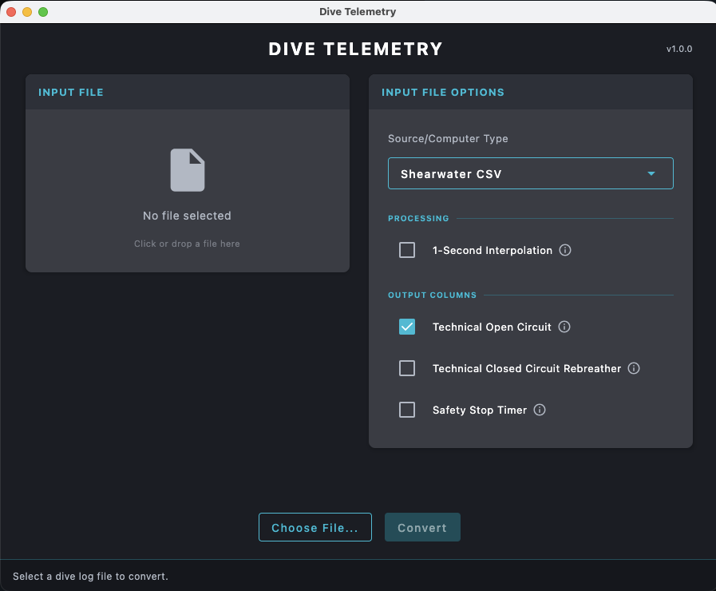

# UI Usage

The Dive Telemetry application provides a web-based user interface for converting dive computer exports into telemetry overlay CSV format.

## Overview

The UI offers a user-friendly interface that allows you to:

- Select your dive computer format
- Select the dive log file
- Configure conversion options
- Open the resulting telemetry CSV

## Getting Started

1. **Select Format**: Choose your dive computer brand from the available options (Shearwater, Garmin, etc.)
2. **Select File**: Select your dive log file (CSV, FIT, ZXY format)
3. **Configure Options**: Choose any additional settings you need
4. **Convert**: Click the convert button to process your dive log
5. **Open**: Use the `OPEN` button to find the generated telemetry CSV in your computer

## Supported Options

The UI provides access to the same conversion options as the CLI:

| Option            | Description                                                    |
|-------------------|----------------------------------------------------------------|
| **Interpolation** | Resample data to 1-second intervals for smoother video overlay |
| **Technical OC**  | Include Technical Open Circuit columns (NDL, deco, clear)      |
| **Technical CCR** | Include Technical CCR columns (PPO2, dilPO2)                   |
| **Safety Stop**   | Enable Safety Stop Timer column                                |
| **Pressure Unit** | Choose tank pressure unit: default, PSI, or bar                |

## Troubleshooting

If you encounter issues with the UI:

- Ensure your dive log file is in the correct format for your dive computer
- Check that your file isn't corrupted
- Try the CLI version if the UI has any compatibility issues
- Refer to the [CLI Usage](./cli-usage.md) documentation for more details
